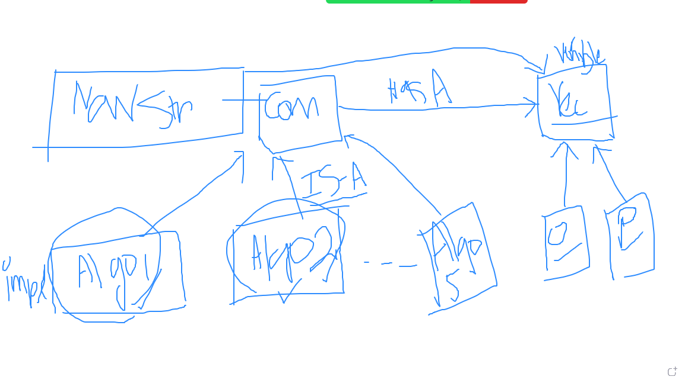

problem 1:
We have two types of Car . Off-road car and passenger car . Both uses navigation system. But navigation system for each car is different. For example off-road car uses ALGO1 for its navigation, where passenger car uses ALGO2 for its navigation. Design this system.

Tips : for navigation u can use some method like compute ()

